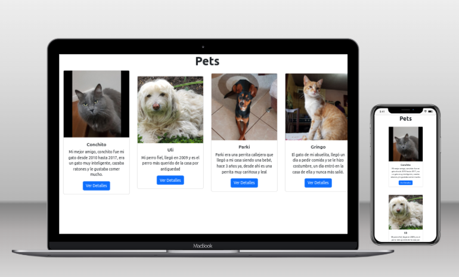

# Juan's Pets (Back End)

> This is the back-end repo for my pets page

You can find it's front-end at https://github.com/Juanse7793/Pets-front-end.

## Back-end Built With

- Next.js
- MongoDB
- Vercel

## Live Demo

[Backend](https://budget-back.vercel.app/)

## Getting Started

To get a local copy up and running follow these simple example steps:

### Prerequisites
- None
### Setup
- Clone this repo using `git clone https://github.com/Juanse7793/Pets-front-end`
### Install
- Run `npm install` then 
- On your terminal `cd nextapi`
- On your terminal `cd strategic`
- Run `npm run dev`
### Usage
- You can use this website to see Juan's Pets make CRUD operations and see the endpoints of pets and movies
### Run tests
- tests were not implemented yet
### Deployment
This app has been deployed using Vercel

## Author

👤 **Juan Sebastian Sotomayor**

- GitHub: [@Juanse7793](https://github.com/Juanse7793)
- Twitter: [@Juanse77930](https://twitter.com/Juanse77930)
- LinkedIn: [Juan Sebastian Sotomayor](https://linkedin.com/in/juan-sebastian-sotomayor-2bb395198)

## 🤝 Contributing

Contributions, issues, and feature requests are welcome!

Feel free to check the [issues page](../../issues/).

## Show your support

Give a ⭐️ if you like this project!

## Acknowledgments

- To Strategic.corp to encourage me to build this proyect. (Leonardo & María)

## 📝 License

This project is [MIT](./MIT.md) licensed.